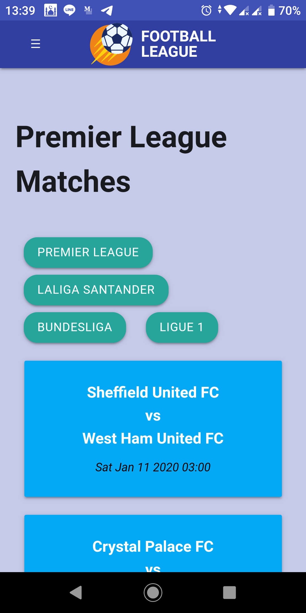

# Learned Membangun PWA Academy Dicoding

This repository is about learning to build applications using Progressive Web Apps, from building portfolios Apps using static web to building Football League Apps using dynamic web from [Football-data.org](https://www.football-data.org) and [Firebase Hosting](https://firebase.google.com/docs/hosting) for web apps.

  
  
  

 

  
  
  

 
 

#### The repository has following packages:

1. **assets**: It contains all images for README.
2. **data-liga**: It contains all repositories about the Football League application.
3. **portofolio**: It contains all repositories about the Portofolio application.

### Library reference resources:

1. Progressive Web Apps: https://developers.google.com/web/progressive-web-apps
2. Materialize: https://materializecss.com
3. Simple Line Icons: https://iconify.design/icon-sets/simple-line-icons
4. Indexed DB: https://github.com/jakearchibald/idb
5. Firebase Cloud Messaging: https://firebase.google.com/docs/cloud-messaging
6. Workbox: https://github.com/GoogleChrome/workbox

## Noted

Please use this as a reference only. Hope this helps you develop more projects.
